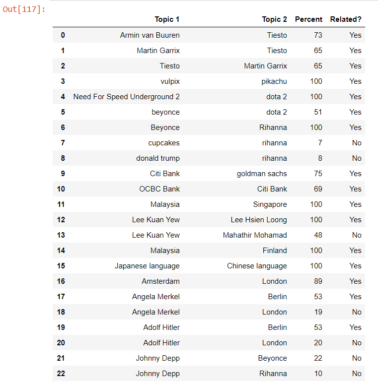
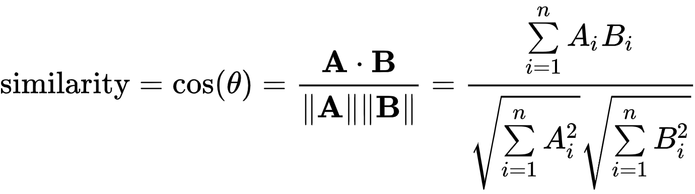
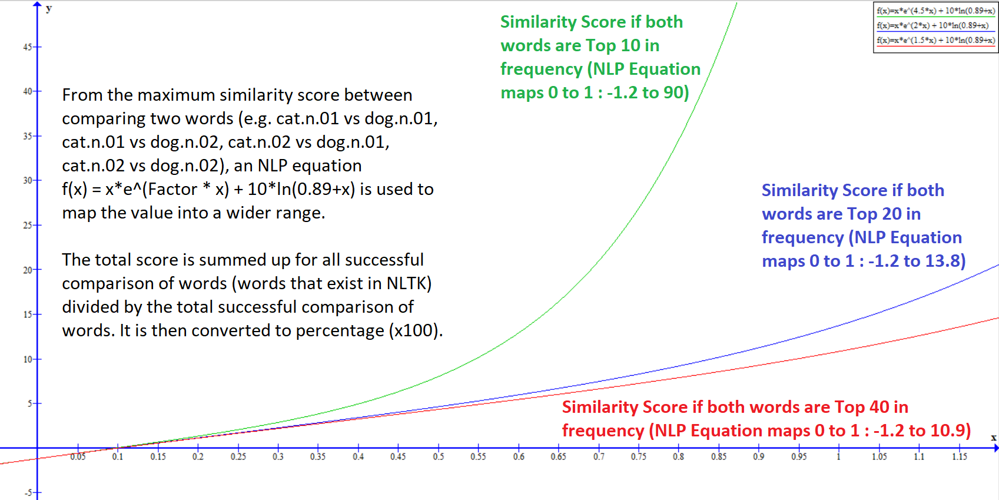

# NLP-Model-for-Corpus-Similarity
A NLP model I developed to determine the similarity or relation between two documents/articles. Inspired by the cosine similarity (angle of two word vectors) concept. Please refer to <b>FINAL. NLP Model for determining similarity of Wiki articles.ipynb</b> for the code. <br><br>
## Installation
```
pip install -r requirements.txt
```
dependencies.txt show all the library dependencies and their versions, but using the requirements.txt will do
<br><br>
## NLP Model for determining the similarity/relation of Wiki Articles
### Inputs two Wikipedia Articles inside and outputs a percentage of similarity
 <br>

### How to use:
<b>Importing comparewiki.py:</b> <br>
```
comparewiki.similar('Amsterdam','Van Gogh')
```
Output: <br>
```
Probability of topics being related is 63%
Count is 240 and sum is 151.61918693607896
```
<b>Importing comparewikilist.py:</b> <br>
```
import numpy as np
djs = comparewikilist.similar('Armin van Buuren', ['Tiesto','Martin Garrix','Swedish House Mafia'], verbose=0)
np.array(djs.iterate())
```
Output: <br>
```
array([['Armin van Buuren', 'Tiesto', '95', 'Yes'],
       ['Armin van Buuren', 'Martin Garrix', '96', 'Yes'],
       ['Armin van Buuren', 'Swedish House Mafia', '81', 'Yes']],
      dtype='<U19')
```
<b>Importing similaritydf.py with slight dataframe manipulation:</b> <br>
```
import similaritydf
from similaritydf import get_df
topics = ['Kygo','Odesza','Armin van Buuren','Ilan Bluestone','Grum','Cascada','Kobe Bryant','LeBron James','Michael Jordan',
          'Cristiano Ronaldo','Lionel Messi','Kylian Mbappé','Chemistry','Biology','Physics','Periodic table']
test_df = get_df(topics)

def see_topic(df, val):
    return df[(df['Topic 1'] == topics[val]) | (df['Topic 2'] == topics[val])]
    .sort_values('Probability', ascending=False)

see_topic(test_df, 0)
```
Output: <br>


| Index | Topic 1 | Topic 2 | Probability | Similar? |
| :---: | :---: | :---: | :---: | :---: |
| 3 | Kygo | Grum | 100 | Yes |
| 4 | Kygo | Cascada | 91 | Yes |
| 0 | Kygo | Odesza | 66 | Yes |
| ... | ... | ... | ... | ... |
| 14 | Kygo | Periodic table | 4 | No |
| 13 | Kygo | Physics | 3 | No |
| 10 | Kygo | Kylian Mbappé | 1 | No |


<br><br>
For extensive Wikipedia articles that I tested and organized in dataframe, please refer to <b>TEST. NLTK Similarity Function (pandas).ipynb, SMLR07. Compare one wiki article to a list of articles (comparewikilist.py).ipynb and TEST03. Testing similaritydf to get dataframe.ipynb </b><br><br>

## Python Files
<b>May 2020 Update</b> - There are 4 Python files that are useful:

| Main Python File | Purpose | Class Name | Function Name | Example | Dependencies |
| :---: | :---: | :---: | :---: | :---: | :---: |
| comparewiki.py | Compare two Wikipedia Articles and obtain their similarity percentage (0-100%) | similar | ans | TEST. NLTK Similarity Function (pandas) - 10 Jun 2019.ipynb | wikionly, requirements.txt |
| comparewikilist.py | Compare a Wikipedia Article against a Python list of Wikipedia Articles, returning a list of results that can be converted to numpy arrays or dataframes | similar | iterate | SMLR07. Compare one wiki article to a list of articles (comparewikilist.py).ipynb | wikionly, requirements.txt |
| similaritydf.py | Uses a Python list of Wikipedia Articles to get all the permutations of Wikipedia Article comparison and their similarities, returns a dataframe | NA | get_df | TEST03. Testing similaritydf to get dataframe.ipynb, SMLR08. DF function for political leaders vs philosophers comparison (similaritydf.py).ipynb | comparewikilist, wikionly, requirements.txt |
| wikionly.py | Used by the other 3 script files above | wiki | commonwords | NA | requirements.txt |

<br>
The script wikiscrape.py (12 May 2020 version) is the original Python script used to scrape Wikipedia articles. This has been transformed into a minimal and optimized version called wikionly.py which is used by comparewiki.py, comparewikilist.py and similaritydf.py.
<br><br>
For more information, please refer to the repo for the <b>Wikipedia Article Scraper Package</b>
(https://github.com/kohjiaxuan/Wikipedia-Article-Scraper)

<br><br>

### Background information for developing NLP Model
The NLP model is inspired by the Cosine Similarity Formula to determine the similarity of two documents. From two text documents or corpus, create two n dimension vectors that stores n total unique words from both documents, with the frequency of the word in each dimension or vector cell. <br><br>

On the numerator, find the dot product of the two vectors and in the denominator, find the product of the "magnitude" or length of the vectors. This value will be the cos θ, between values 0 and 1. If this value is 1 (θ = 0 degrees), the documents are fully identical while if the value is 0 (θ = 90 degrees), they are totally different. <br><br>

 <br><br>

For example, 'I love cats and love dogs' and 'I love dogs and love rabbits'. The first passage will have counter {love: 2, and: 1, I: 1, cats: 1, dogs: 1, rabbits: 0} which is [2,1,1,1,1,0] vectorized. The second passage will have counter {love: 2, and: 1, I: 1, cats: 0, dogs: 1, rabbits: 1} which is [2,1,1,0,1,1]. <br><br>

The numerator dot product is 2x2 + 1x1 + 1x1 + 1x0 + 1x1 + 0x1 = 7 while the denominator is sqrt(2^2+1^2+1^2+1^2+1^2+0) + sqrt(2^2+1^2+1^2+0+1^2+1^2) = sqrt(8) * sqrt(8) = 8. <br><br>

#### cos θ = 7/8 = 0.875. Hence the documents have 87.5% similarity as they have many common words except for dogs and rabbits.

### Issues of cosine similarity algorithm
1. In reality, documents have a large number of unique words (1,000s-10,000s) and it is computationally demanding to determine the similarity with high dimensional word vectors. 
2. cosine similarity equation gives equal weight to all unique words in similarity calculation, but there are a lot of uncommon words in Wikipedia articles and documents in general that should not be penalizing the final score. For example, Beyonce and Rihanna might have different album and track names, but these should not penalize them too heavily as they both produce tracks and release albums.
3. Furthermore, documents with a lot of text tend to have a lot of common English words (I, is, am, and, but, for etc.) which are more for grammar and sentence structure purposes. Hence, these words have to be removed, or the similarity score would be skewed upwards.
4. Given the stylistic writing and different focus of different Wikipedia articles, there will be a lot of different words which causes the cosine formula to give a low similarity percentage. Many Wiki articles (and documents in general) only have a few high frequency words in common that signify that they are related, while the other words are different. These articles are actually similar, and it hints that the top 1-5% of words with highest frequency should have a lot more weight than the other words. <br>
For instance, the Wikipedia Article of Amsterdam and Van Gogh have different content, but they are related as Van Gogh lived in the Netherlands and has a posthumous museum in Amsterdam, and Amsterdam is the capital of the Netherlands with well known museums. Also, Van Gogh is a Dutch and Dutch people live in Amsterdam as well.<br>
5. There might be words that are synonyms - e.g. 'America' vs 'US' that should actually contribute to the similarity score instead of reducing it
6. Therefore, the idea was to develop a new NLP model to calculate the similarity of Wikipedia articles, even if they only share a few high impact words and are not deemed similar in the cosine similarity algorithm.

### How does the NLP Model work?
1. It uses the Wikipedia web scraper that I built, which is able to get a word counter on the most common words and their frequency. After user types in two Wikipedia articles, the web scraper (wikionly.py) runs for both articles and gets the word counter on the 40 most common words. Term frequency is often used as a key indicator of the importance of certain words.
2. In the NLTK package, they have a function word1.path_similarity(word2) that allows you to calculate the similarity between two words, inclding synonyms. We compare the 40 words with each other in a cartesian product manner and get the similarity score between 0 to 1. 
3. As there are many definitions for a word, the top two common definitions (e.g. dog.n.01 and dog.n.02) are compared with the top two of the other word (e.g. cat.n.01 and cat.n.02) and the maximum similarity score is obtained. A try-exception loop is used to figure out if the word has a valid synset for doing path similarity comparison.
### An unique mathematical formula is used: Score = Similarity x e^(Factor x Similarity) + 10 x log(0.89 + Similarity)<br><br>
4. Most words have a NLTK similarity value between 0.07-0.15. This NLTK similarity value is mapped into a formula, much like how the sigmoid function works for logistic regression. For words with similarity value below 0.11, the log function will begin to penalize the total score. On the other hand, for similarity value above 0.15, the exponential function will amplify the total score. If the two words are exactly the same, the score increase will be very high.
5. If two words from two Wiki articles are Top 10 or 20 in frequency, they will have a higher Factor than that of the Top 40 frequency. A factor of 4.5 is given if two words are Top 10 most frequent words, 2 if both words are Top 11-20 most frequent words and 1.5 for Top 21-40 most frequent words<br><br>
 <br><br>
6. The sum of all the scores is divided by the number of comparisons between words of two documents. The total number of possible comparisons between 40 words of both documents is 40x40=1600, but the actual number is about 300-700 as many words do not exist in the NLTK corpus. However, even if the word does not exist in the NLTK corpus, if the word pairs is identical, both the score and comparison count will be computed outside of NLTK.
7. The sum and count will be printed and shown for each comparison of Wiki articles.
8. Use the <b>words()</b> function to view the 40 common words for both Wiki articles and <b>ans()</b> to output answer in list that can be combined into a Pandas dataframe.
9. The final similarity score has a ceiling value of 1 or 100% similarity/related.
<br><br>

### Advantage of NLP Model
1. It only takes the 40 most common words from both Wikipedia articles for computation, reducing the time taken to get results. With good internet connection and RAM, the web scraping, data cleaning, and NLP model would take less than 10 seconds to determine if two Wikipedia articles are related.
2. It has a penalty for words that are not similar and a reward (score increase) for similar words (NLTK similarity > 0.11), much like how the cosine similarity model works
3. It scales up the score for words that are similar and appear frequently in both Wikipedia articles. In many articles, only a few frequent words will hint that the articles are actually related, while the other content are different. This is in line with NLP techniques of using the term frequency to measure the importance of the term/word.
4. It has a stoplist to remove frequent words, which will prevent common words in English and Wikipedia from causing false positives of term importance. Also, the stoplist is customizable according to the needs of the developer.
5. It is able to detect synonyms and award scores for them.
6. With small modifications, you can input two lists of the most frequent words from two documents to run this model instead of scraping Wikipedia articles. (modify the line self.wiki1slice = list(key) to put your own word list within the percent(self,input1,input2): function)

### Dependencies and libraries used:
wikionly.py (adapted from wikiscrape.py with lesser features, please see my other project https://github.com/kohjiaxuan/Wikipedia-Article-Scraper) <br>
Listed in requirements.txt and dependencies.txt
<br>
### Libraries used in wikionly/wikiscrape.py:
requests, bs4, collections, matplotlib, re, os, nltk (optional, only if using stoplist)
<br>
### Libraries used in similaritydf.py:
numpy, pandas
<br>
### Feedback/Questions/Bugs:
Please contact me on my Linkedin https://www.linkedin.com/in/kohjiaxuan/ <br>
If you happen to have an extensive dataset of pairs of Wikipedia articles that are labeled, please let me know as it would be good to do some extensive testing on the NLP model. Thank you!
<br>
### Side Note
13 June 2019 - Based on my understanding of the algorithm, it seems that a factor of 2.5 would be better than 2 for words in Top 11-20. Currently, many pairs of Wikipedia articles that are remotely similar are around 40-49% range (e.g. Physics & Chemistry). If the factor increases, the accuracy of the model would move to about 90%. Hence, changes will be rolled out in due time. 
